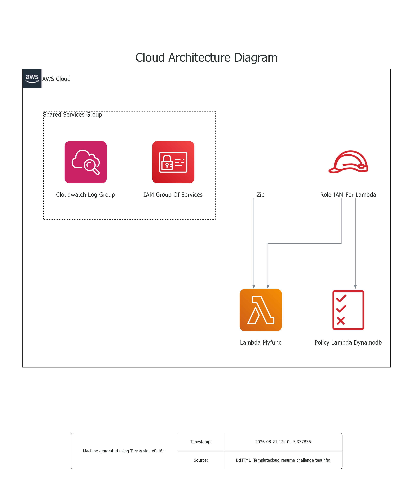

# Cloud Resume Challenge - AWS Serverless & IaC Backend

This repository contains the backend infrastructure and serverless implementation for the **Cloud Resume Challenge**, fully provisioned and managed using **Terraform** (Infrastructure as Code).

The system implements an automated, secure, and cost-effective visitor counter service utilizing AWS serverless primitives, least-privilege access controls, and automated observability.



---

## Architecture Overview

The backend relies on AWS Lambda to process HTTP requests and update the visitor count in DynamoDB. All security boundaries and operational log groups are provisioned alongside the compute resources.

```text
[ Client / Frontend ]
          |  (HTTPS Request)
          v
   [ AWS Lambda: Myfunc ] <------ [ Deployment Package (Zip via archive_file) ]
          |
          +-------------------------------------------+
          v                                           v
[ IAM Role: Role IAM For Lambda ]          [ CloudWatch Log Group ]
          |                                 (Observability & Auditing)
          v
[ IAM Policy: Policy Lambda Dynamodb ]
          | (Least Privilege CRUD)
          v
   [ Amazon DynamoDB ]
```

---

## Infrastructure Components

All resources are declared declaratively in the `infra/` directory:

1. **Compute Layer**:
   * `aws_lambda_function.myfunc`: Executes the visitor counter logic in a serverless environment with zero idle cost.
   * `archive_file` (Zip Data Source): Automatically compresses local application source files into a `.zip` artifact and calculates a `source_code_hash` (SHA-256) to trigger updates on code modifications.

2. **Identity & Access Management (IAM)**:
   * `aws_iam_role` (`Role IAM For Lambda`): Defines the execution role and assume-role trust policy for the Lambda service.
   * `aws_iam_policy` (`Policy Lambda Dynamodb`): Adheres to the **Principle of Least Privilege**, granting scoped access exclusively to the target DynamoDB table (`GetItem`, `UpdateItem`, `PutItem`).
   * `aws_iam_role_policy_attachment`: Binds the fine-grained policy to the Lambda execution role.

3. **Observability & Logging**:
   * `aws_cloudwatch_log_group`: Captures standard output, execution logs, and runtime errors with configured retention periods for auditing and debugging.

---

## Repository Structure

```text
.
├── infra/                          # Terraform Infrastructure as Code
│   ├── main.tf                     # Core resources (Lambda, IAM, CloudWatch)
│   ├── variables.tf                # Input variable declarations
│   ├── outputs.tf                  # Exported values (ARNs, Log Group IDs)
│   ├── .terraform.lock.hcl         # Provider dependency lockfile
│   └── lambda/                     # Backend application code
│       └── func.py                 # Visitor counter handler
├── architecture-aws.dot_2.png      # Architecture diagram generated by TerraVision
├── .gitignore                      # Excludes .tfstate, .terraform, and credentials
└── README.md                       # Project documentation
```

---

## Deployment Guide

### Prerequisites
* [Terraform](https://developer.hashicorp.com/terraform/downloads) (>= 1.5.0)
* Configured [AWS CLI](https://docs.aws.amazon.com/cli/latest/userguide/cli-chap-configure.html) with appropriate deployment credentials (`aws configure`)

### Step-by-Step Deployment

```bash
# 1. Navigate to the infrastructure directory
cd infra

# 2. Initialize Terraform workspace and download required providers
terraform init

# 3. Validate syntax and preview execution plan
terraform plan

# 4. Apply changes and provision resources
terraform apply -auto-approve
```

---

## Engineering Best Practices

* **Declarative IaC**: Replaces manual console configuration (ClickOps) with repeatable, version-controlled infrastructure definitions.
* **Security & Credential Protection**:
  * State isolation: Prevents accidental leaks of sensitive metadata and AWS Account IDs by ignoring `*.tfstate` and `*.tfstate.backup`.
  * Deterministic builds: Tracks `.terraform.lock.hcl` to ensure identical provider binaries across all execution environments.
  * Scoped IAM permissions: Decouples role assumption and data access policies without wildcard permissions.
* **Automated Packaging**: Bundles code packaging and deployment into a unified Terraform pipeline.